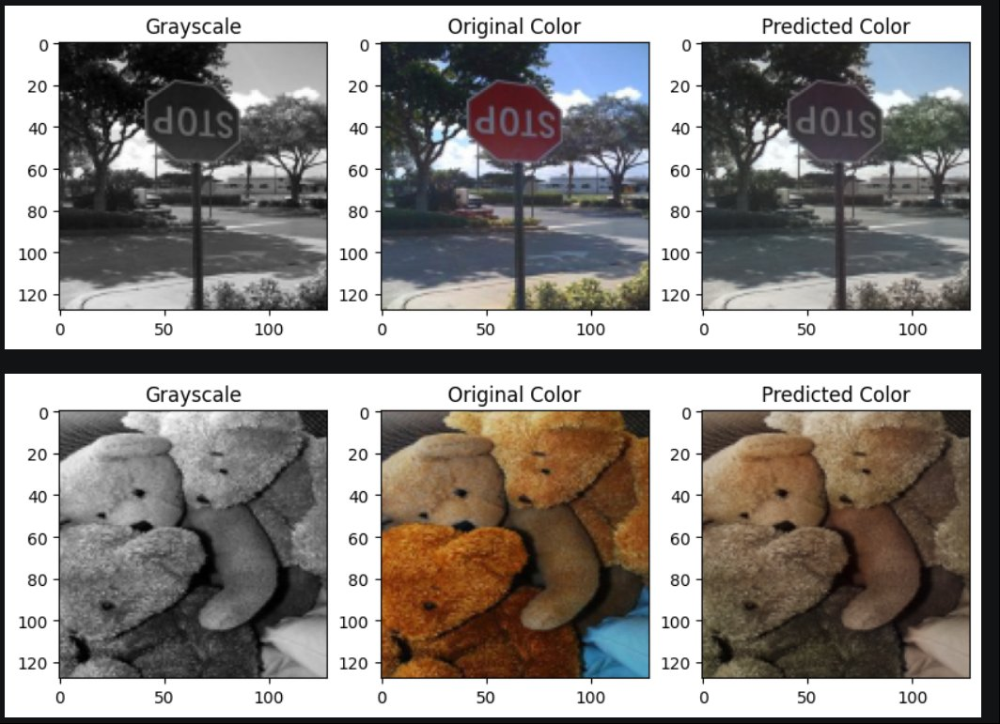

# 🎨 Image & Video Colorization using U-Net (PyTorch)

A deep learning project that automatically colorizes grayscale images and videos using a custom **U-Net architecture** trained in the **LAB color space**. Built with PyTorch and trained on the [Image Colorization dataset from Kaggle](https://www.kaggle.com/datasets/seungjunleeofficial/image-colorization).

---

## 📋 Table of Contents

- [Overview](#overview)
- [Demo](#demo)
- [Architecture](#architecture)
- [Dataset](#dataset)
- [Installation](#installation)
- [Usage](#usage)
  - [Training](#training)
  - [Evaluation](#evaluation)
  - [Video Colorization](#video-colorization)
- [Technical Details](#technical-details)
- [Results](#results)
- [Performance Metrics](#-performance-metrics)
- [Saving & Loading the Model](#saving--loading-the-model)
- [Dependencies](#dependencies)

---

## 🧠 Overview

This project trains a convolutional neural network to predict the color channels of a grayscale image. Rather than working directly in RGB space, it uses the **LAB color space**:

- **L channel** — Lightness (grayscale, input to the model)
- **ab channels** — Color components (predicted by the model)

This separation makes the problem simpler: the model only needs to learn to predict two channels (a, b) from one channel (L), instead of three RGB values from scratch.

---

## 🏗️ Architecture

The model is a **custom U-Net** with skip connections, designed for image-to-image translation.

```
Input (L channel, 1×128×128)
        │
   ┌────▼────┐
   │ Encoder │  (4 blocks: 64 → 128 → 256 → 512 channels)
   └────┬────┘
        │ MaxPool2d (halves resolution at each step)
   ┌────▼────────┐
   │  Bottleneck │  (512 → 1024 → 512 channels)
   └────┬────────┘
        │ Upsample (bilinear, doubles resolution)
   ┌────▼────┐
   │ Decoder │  (3 blocks with skip connections from encoder)
   └────┬────┘
        │
   ┌────▼──────────┐
   │  Final Conv   │  (1×1 conv → 2 channels: ab)
   └────┬──────────┘
        │ Tanh activation → output in [-1, 1]
   Output (ab channels, 2×128×128)
```

### Key Design Choices

| Component | Detail |
|-----------|--------|
| Activation | LeakyReLU (α=0.2) in each Conv-BN-ReLU block |
| Normalization | BatchNorm2d after every convolution |
| Upsampling | Bilinear interpolation (`align_corners=True`) |
| Skip Connections | Encoder features concatenated to decoder at each scale |
| Output Activation | `tanh` to keep ab values in `[-1, 1]` |
| Loss Function | MSELoss (Mean Squared Error) |
| Optimizer | Adam (lr=1e-4) |

---

## 📦 Dataset

The dataset used is [Image Colorization by seungjunleeofficial](https://www.kaggle.com/datasets/seungjunleeofficial/image-colorization) on Kaggle.

**Structure expected:**
```
dataset/
├── train/
│   ├── gray/       ← Grayscale images
│   └── color/      ← Corresponding color images
└── val/
    ├── gray/
    └── color/
```

Images are matched by **sorted filename order**, so gray and color image names must correspond positionally.

---

## ⚙️ Installation

### 1. Clone the Repository

```bash
git clone https://github.com/your-username/image-colorization.git
cd image-colorization
```

### 2. Install Dependencies

```bash
pip install torch torchvision opencv-python numpy matplotlib tqdm kagglehub Pillow
```

### 3. Set Up Kaggle API (for dataset download)

Ensure your Kaggle API credentials are configured:

```bash
mkdir ~/.kaggle
cp kaggle.json ~/.kaggle/
chmod 600 ~/.kaggle/kaggle.json
```

---

## 🚀 Usage

### Training

Open and run `Training_Model.ipynb` from top to bottom, or execute the training block:

```python
device = torch.device("cuda" if torch.cuda.is_available() else "cpu")
model = UNetColorization().to(device)
optimizer = torch.optim.Adam(model.parameters(), lr=1e-4)
criterion = nn.MSELoss()

epochs = 10
for epoch in range(epochs):
    model.train()
    for L, ab in tqdm(train_loader):
        L, ab = L.to(device), ab.to(device)
        pred_ab = model(L)
        loss = criterion(pred_ab, ab)
        optimizer.zero_grad()
        loss.backward()
        optimizer.step()
```

**Training configuration:**
- Image size: `128×128`
- Batch size: `32`
- Epochs: `10`
- Workers: `4`
- Device: CUDA (auto-detected, falls back to CPU)

---

### Evaluation

After training, the notebook evaluates the model on the test set and displays side-by-side comparisons:

```
┌──────────────┬───────────────────┬──────────────────┐
│  Grayscale   │  Original Color   │  Predicted Color │
└──────────────┴───────────────────┴──────────────────┘
```

This is done for 5 sample images from the first batch of the test loader.

---

### Video Colorization

The notebook also supports colorizing full videos frame-by-frame.

**Step 1: Extract frames from a B&W video**
```python
extract_frames("output_bw_video.mp4", "bw_frames_new")
```

**Step 2: Colorize each frame**
```python
for filename in sorted(os.listdir("bw_frames_new")):
    colorize_frame(
        os.path.join("bw_frames_new", filename),
        os.path.join("colored_frames_new", filename)
    )
```

**Step 3: Reconstruct the video**
```python
create_video_from_frames("colored_frames_new", "colorized_output.mp4", fps=30)
```

---

## 🔬 Technical Details

### LAB Color Space

The model operates in **CIE LAB color space** instead of RGB because:

- **L (Lightness)** maps directly to grayscale — no information loss when converting
- **a** encodes the green–red axis
- **b** encodes the blue–yellow axis
- Separating lightness from color makes the prediction task more tractable

**Normalization:**
- L channel: divided by `100` → range `[0, 1]`
- ab channels: divided by `128` → range `[-1, 1]`

### Custom Dataset Class (`ColorizationDataset`)

The `ColorizationDataset` class inherits from `torch.utils.data.Dataset` and overrides:

- `__init__`: loads and sorts filenames from gray/color directories
- `__len__`: returns dataset size
- `__getitem__`: reads, resizes, normalizes, converts to LAB, and returns `(L, ab)` tensors in `(C, H, W)` format

### Skip Connections (U-Net)

Encoder feature maps (`e1`–`e4`) are concatenated with decoder outputs at matching resolutions. This allows fine spatial details lost during downsampling to be recovered during reconstruction.

---

## 📊 Results

After 10 epochs of training with MSELoss, the model successfully learns basic color distributions — sky tones, foliage, neutral surfaces — and produces visually coherent colorizations.

### Sample Output



> Each row shows: **Grayscale input** → **Ground truth color** → **Model prediction**

Observations from the sample:
- **Stop Sign scene**: The model correctly identifies sky as blue and trees as green, but misses the red sign (red is notoriously hard to predict in LAB space without semantic understanding)
- **Teddy Bear scene**: Warm beige/brown tones are well predicted; slight desaturation compared to ground truth is typical for MSE-trained models

---

## 📈 Performance Metrics

Metrics computed by comparing **Predicted Color** vs **Original Color** panels from the evaluation output:

| Sample | PSNR (dB) ↑ | SSIM ↑ | MAE ↓ | MSE ↓ |
|--------|:-----------:|:------:|:-----:|:-----:|
| Stop Sign | 11.72 | 0.4797 | 34.56 | 4375.84 |
| Teddy Bear | 12.01 | 0.4177 | 35.59 | 4089.92 |
| **Average** | **11.87** | **0.4487** | **35.07** | **4232.88** |

### Metric Definitions

| Metric | Full Name | What it measures | Better = |
|--------|-----------|-----------------|----------|
| **PSNR** | Peak Signal-to-Noise Ratio | Pixel-level fidelity (dB scale) | ↑ Higher |
| **SSIM** | Structural Similarity Index | Perceptual structure + contrast similarity (0–1) | ↑ Closer to 1 |
| **MAE** | Mean Absolute Error | Average pixel deviation (0–255 scale) | ↓ Lower |
| **MSE** | Mean Squared Error | Squared pixel deviation (training loss) | ↓ Lower |

### Interpretation

- **PSNR ~11–12 dB** is expected for colorization models trained with MSELoss on only 10 epochs. MSE-trained models tend to predict conservative (desaturated) colors to minimize average loss, which penalizes PSNR. Models trained with perceptual loss or GANs typically reach 22–28 dB.
- **SSIM ~0.45** indicates moderate structural similarity. The model preserves edges and shapes well (from skip connections) but color saturation differences lower the score.
- **MAE ~35/255 ≈ 13.7%** average pixel error — reasonable for a baseline U-Net without perceptual loss or color histogram tricks.

### How to Improve These Scores

| Technique | Expected Gain |
|-----------|--------------|
| Increase epochs (50–100) | +2–4 dB PSNR |
| Add perceptual / VGG loss | +3–5 dB PSNR, +0.1–0.2 SSIM |
| Use GAN (cGAN / Pix2Pix) | Much higher saturation & visual quality |
| Train at 256×256 instead of 128×128 | Better fine detail |
| Data augmentation (flips, jitter) | More generalization |

---

## 💾 Saving & Loading the Model

**Save:**
```python
torch.save(model.state_dict(), "colorization_model.pth")
```

**Load:**
```python
model = UNetColorization()
model.load_state_dict(torch.load("colorization_model.pth", map_location=device))
model.to(device)
model.eval()
```

---

## 📦 Dependencies

| Library | Purpose |
|--------|---------|
| `torch` / `torchvision` | Model training and transforms |
| `opencv-python` (cv2) | Image I/O, LAB conversion, video processing |
| `numpy` | Array operations |
| `matplotlib` | Visualization |
| `tqdm` | Training progress bar |
| `kagglehub` | Dataset download |
| `Pillow` (PIL) | Frame loading for inference |

---

## 📄 License

This project is open-source and available under the [MIT License](LICENSE).

---

## 🙌 Acknowledgements

- Dataset: [seungjunleeofficial on Kaggle](https://www.kaggle.com/datasets/seungjunleeofficial/image-colorization)
- Architecture inspired by the original [U-Net paper](https://arxiv.org/abs/1505.04597) by Ronneberger et al.
- LAB colorization approach inspired by [Zhang et al. (2016)](https://arxiv.org/abs/1603.08511)
